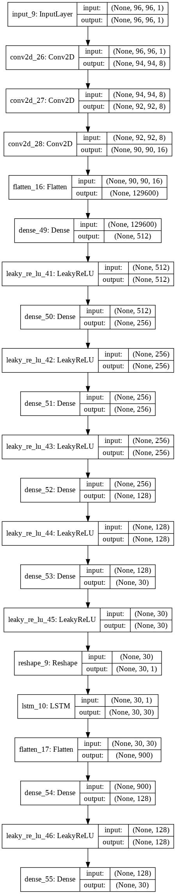
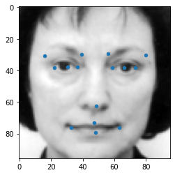
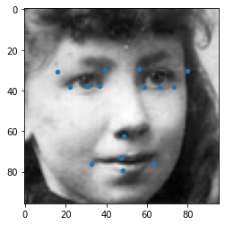
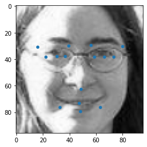
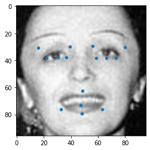
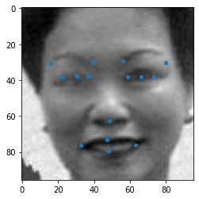

## **Facial Keypoint Detection**

### **Introduction**
In this code, we have focused on tackling a former Kaggle challenge which is still available on link [Facial Keypoint Detection challenge](https://www.kaggle.com/c/facial-keypoints-detection/)

In the provided dataset is comprised on about 7 thousand face 96x96 images along with coordinates of 15 keypoints of the face including,left_eye_center, right_eye_center, left_eye_inner_corner, left_eye_outer_corner, right_eye_inner_corner, right_eye_outer_corner, left_eyebrow_inner_end, left_eyebrow_outer_end, right_eyebrow_inner_end, right_eyebrow_outer_end, nose_tip, mouth_left_corner, mouth_right_corner, mouth_center_top_lip, mouth_center_bottom_lip

The dataset for this competition was graciously provided by Dr. Yoshua Bengio of the University of Montreal. James Petterson.

This code has been developed by **Ali Rahmani Nejad** @arnejad and **Zahra Sarlak** @Z4HRA-S.

### **Our Solution**
Our solution is comprised of a CNN network followed by an LSTM. The image feature representation is learnt in CNN and the output is passed to LSTM to learn the keypoints like a timeseries data. This is due to significance of the relation between these keypoints. The through structure of the Deep Learning Network is illustrated in Fig. 1.

**Fig. 1** - Detailed architecture of the Deep Net

### **Experimentation Results**

Below, some predictions made by this code are demonstrated. 

